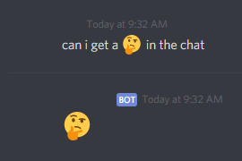

# Mini Bot (Work-In-Progress)
I was made this for my friend's server for fun and experience.  
I currently host this on my own PC using [Node.js](https://nodejs.org/en/).
## Commands
Prefix - `!!`  
`c4` - Base command for Connect 4 game (Currently does not support use multiple servers).  
Primary files: [connect4.js](https://github.com/MiniDomo/Mini-Bot/blob/master/connect4.js), [commands.js](https://github.com/MiniDomo/Mini-Bot/blob/master/commands.js) 
```
!!c4 [sub-command]
```
- `ff` - Surrender your current game.  
  Primary files: [connect4.js](https://github.com/MiniDomo/Mini-Bot/blob/master/connect4.js), [commands.js](https://github.com/MiniDomo/Mini-Bot/blob/master/commands.js)
- `help` - Shows the sub-commands of `!!c4`.  
  Primary files: [connect4.js](https://github.com/MiniDomo/Mini-Bot/blob/master/connect4.js), [commands.js](https://github.com/MiniDomo/Mini-Bot/blob/master/commands.js)
- `p [coordinate]` - Places your piece on the board.  
  Primary files: [connect4.js](https://github.com/MiniDomo/Mini-Bot/blob/master/connect4.js), [commands.js](https://github.com/MiniDomo/Mini-Bot/blob/master/commands.js)
  ```
  !!c4 p [A/a/B/b/C/c/D/d/E/e/F/f/G/g]
  ```
- `start [user1] [user2]` - Start a game with another player. Only one game can be in progress.  
  Primary files: [connect4.js](https://github.com/MiniDomo/Mini-Bot/blob/master/connect4.js), [commands.js](https://github.com/MiniDomo/Mini-Bot/blob/master/commands.js)
  ```
  !!c4 start @user1 @user2
  ```
`help` - Shows a list of the available commands.  
Primary files: [commands.js](https://github.com/MiniDomo/Mini-Bot/blob/master/commands.js)
```
!!help
```
`info` - Shows some information of the bot.  
Primary files: [commands.js](https://github.com/MiniDomo/Mini-Bot/blob/master/commands.js)
```
!!info
```
`randomtard` - Calls Somchu a retard. Not actually random. (This was made specifically for my server as a joke).  
Primary files: [commands.js](https://github.com/MiniDomo/Mini-Bot/blob/master/commands.js)
```
!!randomtard
```
`syscmd [grant/deny] [user] [command]` - Grants or denies the power to use certain commands. Currently only one user's ID is supported. ID can be set by creating a `syscmd.txt` file and putting in the user's ID.  
Primary files: [systemcommand.js](https://github.com/MiniDomo/Mini-Bot/blob/master/systemcommand.js), [commands.js](https://github.com/MiniDomo/Mini-Bot/blob/master/commands.js)
```
!!syscmd grant @user help
```
### YouTube Commands (Supports multiple servers)
`play` - Plays YouTube video audio through the bot. Currently supports only YouTube links.  
Primary files: [music.js](https://github.com/MiniDomo/Mini-Bot/blob/master/music.js), [commands.js](https://github.com/MiniDomo/Mini-Bot/blob/master/commands.js)
```
!!play [youtube link/<youtube link>]
```
`queue` - Lists the current songs in the queue.  
Primary files: [music.js](https://github.com/MiniDomo/Mini-Bot/blob/master/music.js), [commands.js](https://github.com/MiniDomo/Mini-Bot/blob/master/commands.js)
```
!!queue
```
`repeat [song/queue/state]` - Repeats either the current song/video or current queue. `state` will show the current status of `song` and `queue`, which can be either true or false.  
Primary files: [music.js](https://github.com/MiniDomo/Mini-Bot/blob/master/music.js), [commands.js](https://github.com/MiniDomo/Mini-Bot/blob/master/commands.js)
```
!!repeat song
```
`skip` - Skips the current video.  
Primary files: [music.js](https://github.com/MiniDomo/Mini-Bot/blob/master/music.js), [commands.js](https://github.com/MiniDomo/Mini-Bot/blob/master/commands.js)
```
!!skip
```
`stop` - Stops the current video and causes the bot to leave.  
Primary files: [music.js](https://github.com/MiniDomo/Mini-Bot/blob/master/music.js), [commands.js](https://github.com/MiniDomo/Mini-Bot/blob/master/commands.js)
```
!!stop
```
## Features
`Can I get a ___ in the chat` - Uses regex to return what the user put in the `___` in the chat. In addition, it blocks a user from using this feature, in my case Somchu, and returns a nasty message. Currently blocks only one user and can be modified by creating a `CIGATC_blocked.txt` file and putting in the user's ID.  
Primary files: [index.js](https://github.com/MiniDomo/Mini-Bot/blob/master/index.js), [methods.js](https://github.com/MiniDomo/Mini-Bot/blob/master/methods.js)
<br>
<br>
